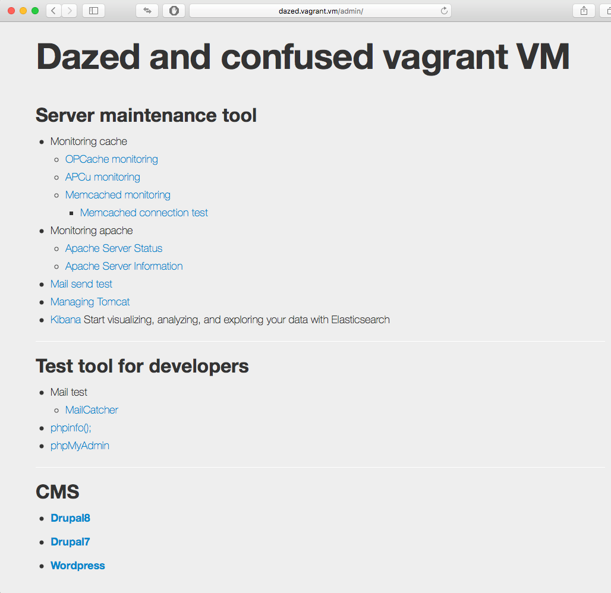
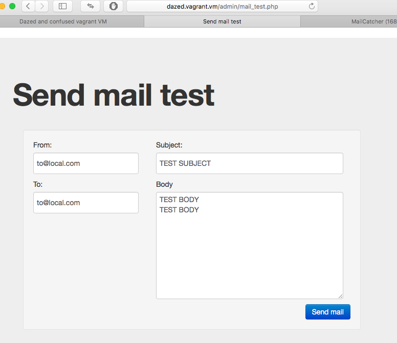
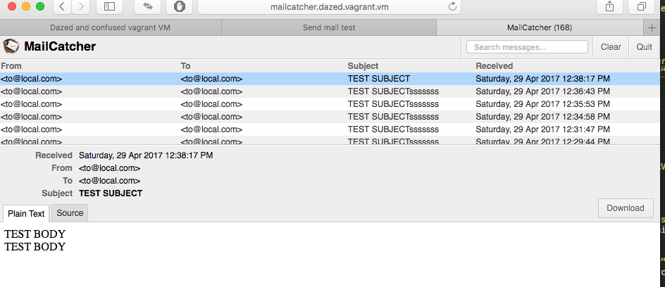
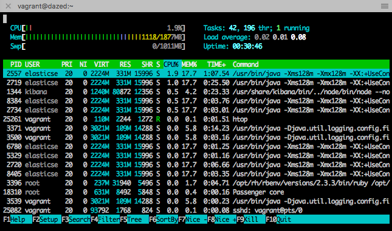

# Dazed and Confused Vagrant VM
* It is vagrant vm made while listening to Led Zeppelin's "Dazed and Confused".

## Purpose
* Construction of local development environment for enterprise

## Concept
* I am not planning to do advanced features, advanced.
* I try to work lightly.

## Overview
* Virtual machines are **Vitrualbox**
* Virtual machine management is **Vagrant**
* Middleware configuration management is **Ansible**

## What is set up

### Middleware
1. **CentOS 7.2**
1. **Java** - v1.8.0
  * **Tomcat** - v8~
  * **Elasticsearch** - v5.x~
  * **Kibana**
  * **Logstash**
1. **MySQL** - v5.6~
1. **PHP** - v7.1, v5.6, v5.5(Multiple)
  * **Opcache**
  * **APC**
1. **Ruby** - v2.4.1
  * **[Mailcatcher](https://mailcatcher.me)**
  * **Redmine** - v3.3
1. **Memcached** - v1.4
1. **Ansible** - v2.4.2.0
1. **ImageMagick**

### SCM
1. **SVN** - v1.7.14~
1. **GIT** - v1.8.3.1~
1. **HG** - v2.6.2~
1. **[Bash-it](https://github.com/Bash-it/bash-it)**

### CMS
1. **Drupal7** - v7.54
1. **Drupal8** - v8.2.6~
1. **Wordpress** - v4.7.2~

### Command line
1. **htop**
1. **colordiff**
1. **multitail**

---
## Required Spec

* Free Memory Size: 2GB - 4GB
* HDD Disk free size: 10GB Over
* Provider is Virtualbox only

## How to insall

### Install vagrant command

* There is only an installer on MacOS.

```
$ cd install/MacOSX/
$ sh install_vagrant.sh
```

* Windows7 user
  * Windows 7 requires PowerShell upgrade
	* Installed referring to DrupalVM's [Windows](http://docs.drupalvm.com/en/latest/getting-started/installation-windows/) page.
    * PowerShell 3.0 or higher
  * vagrant-winnfsd plugin
```
$ vagrant plugin install vagrant-winnfsd
```

### Start the VM with vagrant and start building it

```
$ cd ../../vagrant/
$ sh vagrant up
```

## Confirmation

### Admin page

  * Access by the following URL
  * http://dazed.vagrant.vm/admin/

### Send mail test
* Send from mail test form
* http://dazed.vagrant.vm/admin/mail_test.php

* Mail sent can be confirmed with mailcachter.
* It will never be sent to the outside.
* http://mailcatcher.dazed.vagrant.vm


### htop command

```
$ vagrant ssh
$ htop
```



---

## Usual vagrant operation

```
$ cd vagrant/
$ vagrant up
$ vagrant halt
$ vagrant destroy
$ vagrant suspend
$ vagrant resume
etc...
```

# Ansible

## Structure of ansible files

```
provision/
├── ansible.cfg
├── backend.yml
├── group_vars         # Variables by environment
│   ├── all.yml        # Variables of all environments
│   ├── backend
│   │   └── all.yml
│   ├── development
│   │   └── all.yml
│   ├── staging
│   │   └── all.yml
│   ├── production
│   │   └── all.yml
│   └── localhost
│       └── all.yml
├── hosts            # Host setting per environment
│   ├── backend
│   ├── development
│   ├── staging
│   ├── production
│   └── localhost
├── roles            # Package by application
│   ├── httpd
│   │   ├── handlers
│   │   ├── tasks
│   │   └── templates
│   ├── java         # Case of grouping
│   │   ├── elasticsearch
│   │   │   ├── elasticsearch
│   │   │   │   ├── handlers
│   │   │   │   ├── tasks
│   │   │   │   └── templates
│   │   │   ├── kibana
│   │   │   │   ├── handlers
│   │   │   │   ├── tasks
│   │   │   │   └── templates
│   │   │   └── logstash
│   │   │       ├── tasks
│   │   │       └── templates
│   │   ├── java.yml
│   │   └── tomcat
│   │       ├── handlers
│   │       │   └── main.yml
│   │       ├── tasks
│   │       │   └── main.yml
│   │       └── templates
│   ├── memcached
│   │   ├── handlers
│   │   ├── tasks
│   │   └── templates
│   ├── mysqld
│   │   ├── handlers
│   │   ├── tasks
│   │   └── templates
│   ├── php
│   │   ├── handlers
│   │   ├── tasks
│   │   └── templates
└── vagrant_build.yml
```

## Example of ansible command

```
$ cd dazed-confused-vagrant-vm/vagrant/provision
```

### When ansible is executed without using the vagrant command

```
$ ansible-playbook -i hosts/localhost vagrant_build.yml
```

----


### Build backend server

```
$ ansible-playbook -i hosts/backend backend.yml
```
* Redmine, scm manager, etc.

### Build development server

```
$ ansible-playbook -i hosts/development webservers.yml
```
